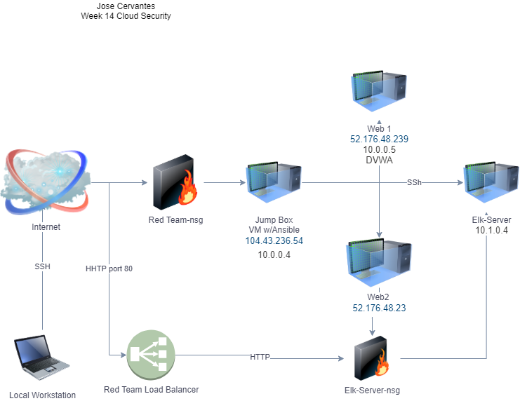
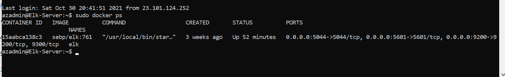

## Automated ELK Stack Deployment

The files in this repository were used to configure the network depicted below.

These files have been tested and used to generate a live ELK deployment on Azure. They can be used to either recreate the entire deployment pictured above. Alternatively, select portions of the __YML___ file may be used to install only certain pieces of it, such as Filebeat.

  - ---
- name: Configure Elk VM with Docker
  hosts: elk
  remote_user: azadmin
  become: true
  tasks:
    # Use apt module
    - name: Install docker.io
      apt:
        update_cache: yes
        name: docker.io
        state: present

      # Use apt module
    - name: Install pip3
      apt:
        force_apt_get: yes
        name: python3-pip
        state: present

      # Use pip module
    - name: Install Docker python module
      pip:
        name: docker
        state: present

      # Use sysctl module
    - name: Use more memory
      sysctl:
        name: vm.max_map_count
        value: "262144"
        state: present
        reload: yes

      # Use docker_container module
    - name: download and launch a docker elk container
      docker_container:
        name: elk
        image: sebp/elk:761
        state: started
        restart_policy: always
        published_ports:
          - 5601:5601
          - 9200:9200
          - 5044:5044

      # Use systemd module
    - name: Enable service docker on boot
      systemd:
        name: docker
        enabled: yes

This document contains the following details:
- Description of the Topology
- Access Policies
- ELK Configuration
  - Beats in Use
  - Machines Being Monitored
- How to Use the Ansible Build

### Description of the Topology

The main purpose of this network is to expose a load-balanced and monitored instance of DVWA, the D*mn Vulnerable Web Application.

Load balancing ensures that the application will be highly available, in addition to continuous access to the network.
- Load balancers work on availability security. The advantage of a jumpbox is that with ansible you can automate the creation of the settings for each VM along with the YML files.

Integrating an ELK server allows users to easily monitor the vulnerable VMs for changes to the metric and system files.
- _Filebeat logs file access and modifications
- _Metricbeat log the RAM and CPU usage

The configuration details of each machine may be found below.
_Note: Use the [Markdown Table Generator](http://www.tablesgenerator.com/markdown_tables) to add/remove values from the table_.

| Name     | Function | IP Address | Operating System |
|----------|----------|------------|------------------|
| Jump Box | Gateway  |52.173.32.166 10.0.0.4| Linux            |
| Web 1    | DVwA Server         |     10.0.0.5       |          Linux        |
| Web 2   |     DVWA Server     |       10.0.0.6     |    Linux              |
| Elk      |     Elk Server     |     52.160.106.14       |        Linux          |

### Access Policies

The machines on the internal network are not exposed to the public Internet. 

Only the JUMPBOX machine can accept connections from the Internet. Access to this machine is only allowed from the following IP addresses:
- Whitelisted IP address 71.231.185.246

Machines within the network can only be accessed by Jumpbox.
-  52.173.32.166

A summary of the access policies in place can be found in the table below.

| Name     | Publicly Accessible | Allowed IP Addresses |
|----------|---------------------|----------------------|
| Jump Box | Yes           |  71.231.185.246   |
|    Web1      |   No                  |       None               |
|       Web2   |  No                   |   None                   |
|    ELk      |    Yes         |     71.231.185.246   |  
### Elk Configuration

Ansible was used to automate configuration of the ELK machine. No configuration was performed manually, which is advantageous because it prevents human error and makes the proccess faster.

The playbook implements the following tasks:
- Use apt module install docker.io
- Install pip3
- Use pip module Install Docker python module
-  Use sysctl module Use more memory
-   Use docker_container module download and launch a docker elk container
-    Use systemd module Enable service docker on boot
The following screenshot displays the result of running `docker ps` after successfully configuring the ELK instance.

### Target Machines & Beats
This ELK server is configured to monitor the following machines:
- 10.0.0.5
- 10.0.0.6

We have installed the following Beats on these machines: Filebeat and Metricbeat

These Beats allow us to collect the following information from each machine:
-Filebeat monitors the log files of the DVWA maciines.I would expect filebeat collect all the log events and forward them to Logstash. Metricbeat helps monitor the DVWA servers. I would expect metricbeat to collect the metrics from the system, and all services. Once collected metricbeat will send the metrics to Logstash.

### Using the Playbook
In order to use the playbook, you will need to have an Ansible control node already configured. Assuming you have such a control node provisioned: 

SSH into the control node and follow the steps below:
- Copy the pentest2.yml file to /etc/anisibe directory.
- Update the hosts file to include to include the Elk server.
- Run the playbook, and navigate to http://13.83.9.21:5601/app/kibana#/home to check that the installation worked as expected.

